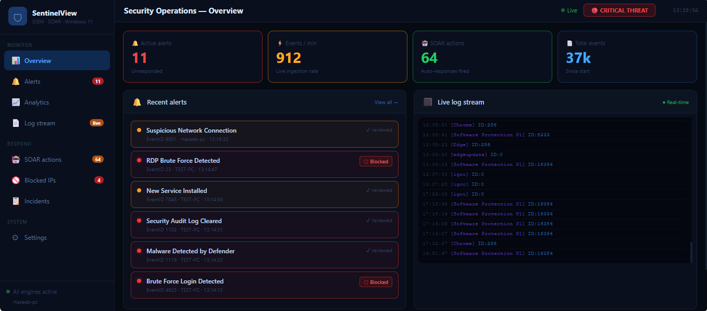
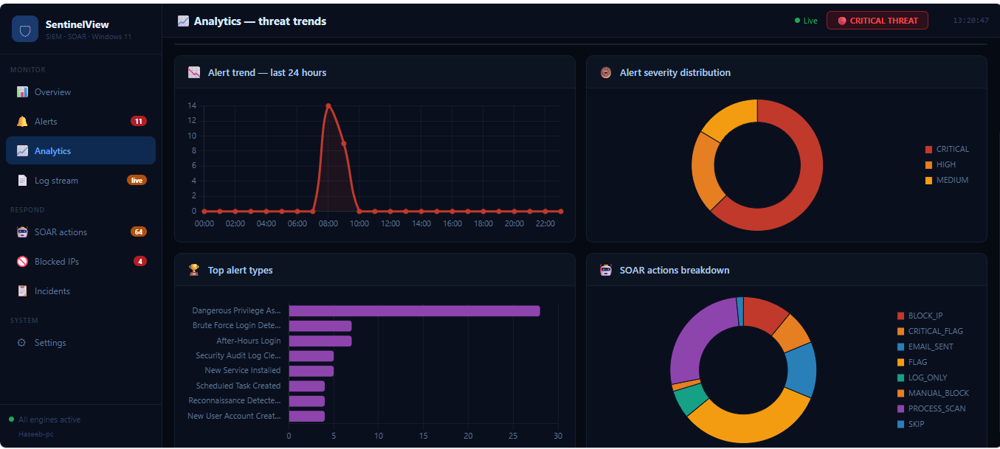
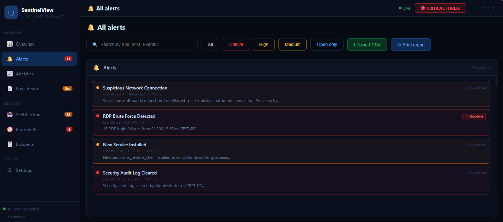
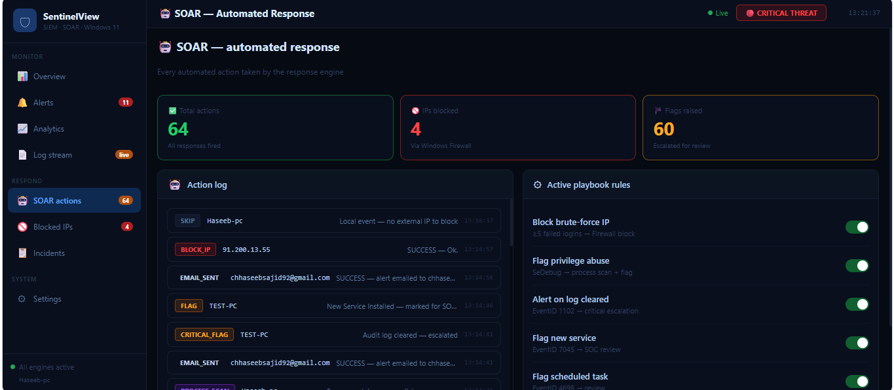

# 🛡️ SentinelView — Windows 11 SIEM + SOAR Platform

> Real-time threat detection and automated incident response built entirely in Python


---

## 📸 Screenshots

### Overview — Live threat monitoring


### Analytics — Threat trends and charts


### Alerts — AI-classified security alerts


### SOAR — Automated response log


---

## 🔍 What is SentinelView

SentinelView is a complete cybersecurity monitoring platform built
from scratch for Windows 11. It works exactly like enterprise tools
such as Splunk and IBM QRadar — but built entirely in Python as a
personal learning project.

It collects Windows Event Logs every 5 seconds, analyses them using
17 threat detection rules, automatically responds to attacks using
SOAR playbooks, and displays everything on a live web dashboard
accessible from any browser.

---

## ⚡ Key features

- Real-time log collection — Security, System, Defender, PowerShell, RDP, USB logs
- 17 threat detection rules — covering brute force, malware, privilege escalation, lateral movement
- Automated SOAR response — blocks IPs, disables accounts, kills processes, sends emails
- Live dashboard — real-time charts, analytics, log stream, alert management
- One-click startup — double-click to launch, browser opens automatically
- Export reports — download alerts as CSV or print as PDF
- Email notifications — Gmail alert on every CRITICAL threat
- Network monitoring — detects suspicious outbound connections in real time

---

## 🏗️ Architecture
┌─────────────────────────────────────────────────┐

│              Windows 11 Host                     │

│                                                  │

│  Security Logs  System Logs  Defender  PS Logs  │

│         │            │          │          │     │

│         └────────────┴──────────┴──────────┘     │

│                       │                          │

│              collector.py                        │

│         (reads every 5 seconds)                  │

│                       │                          │

│              sentinel.db (SQLite)                │

│                       │                          │

│              detector.py                         │

│         (17 threat detection rules)              │

│                       │                          │

│              alerts table                        │

│                       │                          │

│              soar.py                             │

│    ┌──────────────────┼──────────────────┐       │

│    │                  │                  │        │

│  Block IP        Disable User      Kill Process   │

│  Firewall        net user          psutil         │

│    │                  │                  │        │

│    └──────────────────┼──────────────────┘       │

│                       │                          │

│              app.py (Flask + WebSocket)           │

│                       │                          │

│         http://localhost:5000                    │

│              Live Dashboard                      │

└─────────────────────────────────────────────────┘

---

## 🎯 Threat detection rules

| # | Rule | Trigger | Severity |
|---|------|---------|----------|
| 1 | Brute Force Login | 5+ failed logins in 5 min | 🔴 CRITICAL |
| 2 | Account Locked Out | EventID 4740 | 🟠 HIGH |
| 3 | Audit Log Cleared | EventID 1102 | 🔴 CRITICAL |
| 4 | New User Account Created | EventID 4720 | 🟠 HIGH |
| 5 | User Account Deleted | EventID 4726 | 🟠 HIGH |
| 6 | Dangerous Privilege Assigned | SeDebugPrivilege | 🔴 CRITICAL |
| 7 | New Service Installed | EventID 7045 | 🟠 HIGH |
| 8 | Scheduled Task Created | EventID 4698 | 🟡 MEDIUM |
| 9 | Malware Detected | EventID 1116 | 🔴 CRITICAL |
| 10 | Windows Defender Disabled | EventID 5001 | 🔴 CRITICAL |
| 11 | Malicious PowerShell | Encoded commands | 🔴 CRITICAL |
| 12 | RDP Brute Force | Multiple RDP failures | 🔴 CRITICAL |
| 13 | After-Hours Login | Outside 07:00-22:00 | 🟡 MEDIUM |
| 14 | USB Device Connected | Removable storage | 🟡 MEDIUM |
| 15 | Suspicious Network Connection | Bad ports/IPs | 🟠 HIGH |
| 16 | Reconnaissance Detected | Group enumeration | 🟠 HIGH |
| 17 | User Added to Admin Group | EventID 4728/4732 | 🔴 CRITICAL |

---

## 🤖 SOAR automated responses

| Threat detected | Automated action taken |
|----------------|----------------------|
| Brute Force Attack | Block attacker IP via Windows Firewall |
| RDP Brute Force | Block attacker IP via Windows Firewall |
| Mimikatz / Credential dump | Scan running processes and kill threats |
| Malware detected | Process scan and terminate |
| Unauthorized user created | Automatically disable the account |
| Privilege escalation | Disable the user account |
| Suspicious network connection | Block the destination IP |
| Any CRITICAL alert | Send email notification via Gmail |

---

## 📊 Dashboard pages

| Page | Description |
|------|-------------|
| 🏠 Overview | Live metrics, recent alerts, real-time log stream |
| 📈 Analytics | Hourly event charts, severity distribution, alert trends |
| 🔔 Alerts | Search, filter by severity, export CSV, print PDF |
| 📄 Log stream | Live Windows Event Log with pause and filter |
| 🤖 SOAR actions | Full audit trail of every automated response |
| 🚫 Blocked IPs | All firewall rules with one-click unblock |
| 📋 Incidents | Chronological incident timeline |
| ⚙ Settings | Detection thresholds and SOAR toggles |

---

## 🚀 Installation

### Requirements

- Windows 11
- Python 3.11+
- Administrator privileges
- Gmail account with App Password

### Quick start

**1. Clone the repository**
```bash
git clone https://github.com/chaudry-ch/SentinelView.git
cd SentinelView
```

**2. Install dependencies**
```bash
pip install flask flask-socketio pywin32 psutil requests eventlet
python -m pywin32_postinstall -install
```

**3. Create the database**
```bash
python db_setup.py
```

**4. Configure email alerts**

Open `soar.py` and fill in your details:
```python
EMAIL_SENDER   = "your_gmail@gmail.com"
EMAIL_PASSWORD = "your_gmail_app_password"
EMAIL_RECEIVER = "your_gmail@gmail.com"
```

To get an app password:
`Google Account → Security → 2-Step Verification → App passwords`

**5. Launch SentinelView**

Right-click `START_SENTINEL.bat` → **Run as administrator**

The dashboard opens automatically at `http://localhost:5000`

---

## 📁 Project structure
SentinelView/

├── collector.py          # Windows log collector (reads every 5s)

├── detector.py           # Threat detection engine (17 rules)

├── soar.py               # SOAR automated response engine

├── app.py                # Flask API + WebSocket server

├── index.html            # Complete dashboard frontend

├── db_setup.py           # Database initialization script

├── launcher.py           # Multi-engine startup manager

├── START_SENTINEL.bat    # One-click Windows launcher

├── agent.py              # Remote machine monitoring agent

├── config_example.txt    # Configuration guide

└── README.md             # This file

---

## 🛠️ Tech stack

| Layer | Technology | Purpose |
|-------|-----------|---------|
| Language | Python 3.11 | All backend logic |
| Web framework | Flask | REST API server |
| Real-time | Flask-SocketIO | WebSocket live updates |
| Database | SQLite | Event and alert storage |
| Frontend | HTML + CSS + JS | Dashboard UI |
| Charts | Chart.js | Analytics visualisation |
| Windows logs | pywin32 | Event Log access |
| Process monitor | psutil | Process scanning |
| Email | smtplib | Gmail notifications |
| Firewall | netsh | IP blocking |
| User mgmt | net user | Account management |

---

## 🎓 What I learned

Building SentinelView taught me how real enterprise security tools work:

- **SIEM internals** — how Splunk and IBM QRadar ingest and correlate logs
- **Windows security** — Event Log channels, EventIDs, and what they mean
- **SOAR playbooks** — designing automated incident response workflows
- **Web development** — REST APIs, WebSockets, real-time dashboards
- **Database design** — structuring security event storage efficiently
- **Windows internals** — Firewall rules, user accounts, process management
- **Threat detection** — turning attack patterns into detection logic

---

## ⚠️ Security notice

- Requires Administrator privileges on Windows 11
- Only monitor machines you own or have permission to monitor
- Never upload `sentinel.db` — it contains real system logs
- Replace email placeholders with your own credentials before running

---

## 👤 Author

Muhammad Haseeb Sajid — Cybersecurity student and developer

Passionate about blue team security, threat detection, and building
tools that solve real problems.

- GitHub: [@chaudry-ch](https://github.com/chaudry-ch)

---

## 📄 License

MIT License — free to use, learn from, and build upon.

---

⭐ If this project helped you learn something, please give it a star!
